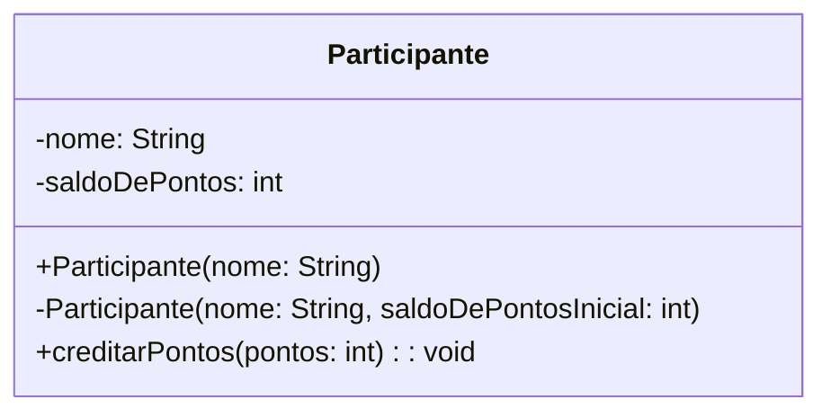

**(continuação do desafio 10.07)**

O desenvolvedor sênior avaliou o seu código e pediu para que você fizesse algumas melhorias:

-   Organização das classes em pacotes (considere que o domínio na internet da empresa onde você trabalha é _algamilhas.com.br_)
-   Especificar os modificadores de acesso nos membros da classe `Participante`
-   Implementar um método `creditarPontos`, que soma a quantidade de pontos recebida como argumento no saldo

Veja os detalhes no diagrama de classes que ele te enviou:

Depois que implementar, note o que deixou de funcionar na classe `Principal`.

