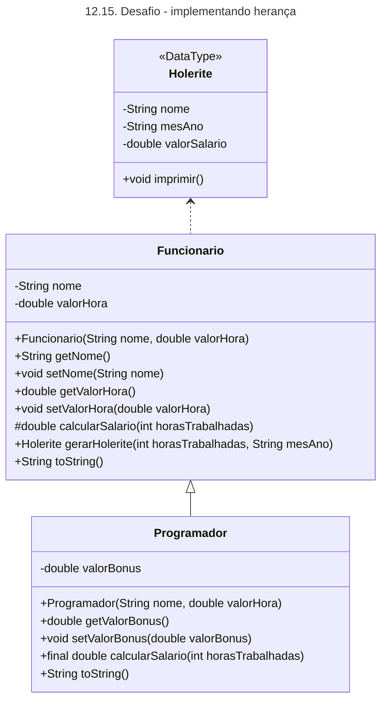

```mermaid  
---
title: 12.15. Desafio - implementando herança
---
classDiagram
    class Holerite {
        <<DataType>>
        -String nome
        -String mesAno
        -double valorSalario
        +void imprimir()
    }

    class Funcionario {
        -String nome
        -double valorHora
        +Funcionario(String nome, double valorHora)
        +String getNome()
        +void setNome(String nome)
        +double getValorHora()
        +void setValorHora(double valorHora)
        #double calcularSalario(int horasTrabalhadas)
        +Holerite gerarHolerite(int horasTrabalhadas, String mesAno)
        +String toString()
    }

    class Programador {
        -double valorBonus
        +Programador(String nome, double valorHora)
        +double getValorBonus()
        +void setValorBonus(double valorBonus)
        +final double calcularSalario(int horasTrabalhadas)
        +String toString()
    }

    %% Funcionario usa holerite
    Holerite <.. Funcionario
    
    Funcionario <|-- Programador
```
