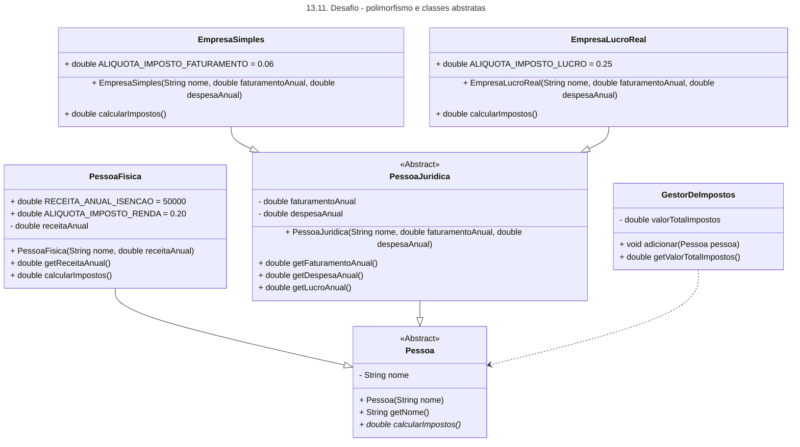

```mermaid  
---
title: 13.11. Desafio - polimorfismo e classes abstratas
---
classDiagram
    class Pessoa {
	    <<Abstract>>
        - String nome
        + Pessoa(String nome)
        + String getNome()
        + double calcularImpostos()*
    }
    
    class GestorDeImpostos {
        - double valorTotalImpostos
        + void adicionar(Pessoa pessoa)
        + double getValorTotalImpostos()
    }
    
    class PessoaFisica {
        + double RECEITA_ANUAL_ISENCAO = 50000
        + double ALIQUOTA_IMPOSTO_RENDA = 0.20
        - double receitaAnual
        + PessoaFisica(String nome, double receitaAnual)
        + double getReceitaAnual()
        + double calcularImpostos()
    }
    
    class PessoaJuridica {
	    <<Abstract>>
        - double faturamentoAnual
        - double despesaAnual
        + PessoaJuridica(String nome, double faturamentoAnual, double despesaAnual)
        + double getFaturamentoAnual()
        + double getDespesaAnual()
        + double getLucroAnual()
    }
    
    class EmpresaSimples {
        + double ALIQUOTA_IMPOSTO_FATURAMENTO = 0.06
        + EmpresaSimples(String nome, double faturamentoAnual, double despesaAnual)
        + double calcularImpostos()
    }
    
    class EmpresaLucroReal {
        + double ALIQUOTA_IMPOSTO_LUCRO = 0.25
        + EmpresaLucroReal(String nome, double faturamentoAnual, double despesaAnual)
        + double calcularImpostos()
    }

    PessoaFisica --|> Pessoa
    PessoaJuridica --|> Pessoa
    EmpresaSimples --|> PessoaJuridica
    EmpresaLucroReal --|> PessoaJuridica
    GestorDeImpostos ..> Pessoa
```
